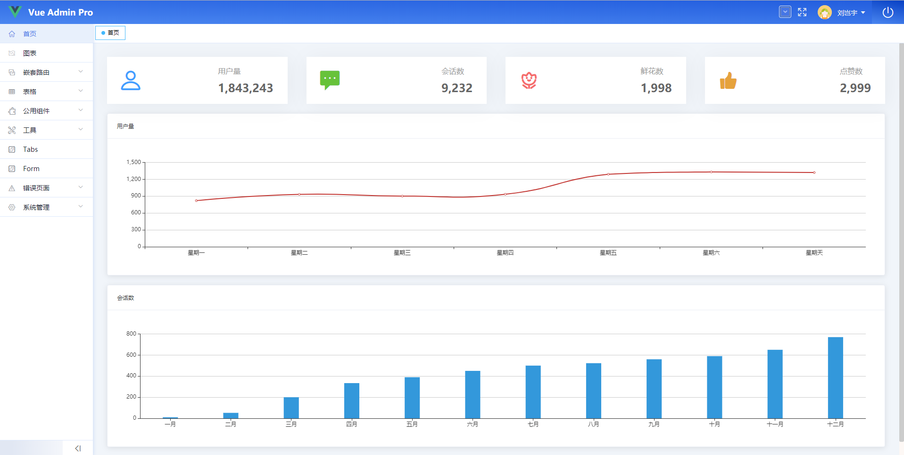

<p align="center">
  
</p>

## 简介

`vue-element-admin` 是一个后台前端解决方案，它基于 `vue` 和 `element-ui`实现。它使用了最新的前端技术栈，提炼了典型的业务模型，提供了丰富的功能组件，它可以帮助你快速搭建企业级中后台产品原型。相信不管你的需求是什么，本项目都能帮助到你。

- [在线预览]()

- [使用文档](https://liuqiyu.github.io/yunotes/vue-admin-pro/)

本项目基于`vue-cli3`脚手架搭建。

  

## 项目目录

## 功能结构

- 首页
- 弹窗
- 图标
- 错误页面
  - 404
  - 401
- 嵌套路由
  - 路由 1
  - 路由 2
  - 路由 3
    - 路由 3-1
      - 路由 3-1-1
- 表格
  - 表格弹窗
  - 表格详情
  - 自定义表头

## 组件

- [QueryForm 查询表单](https://liuqiyu.github.io/yunotes/vue-admin-pro/components/query-form.html)
- [Dialog 弹出窗组件基本用法](https://liuqiyu.github.io/yunotes/vue-admin-pro/components/dialog.html)
- [ToolBar 按钮菜单](https://liuqiyu.github.io/yunotes/vue-admin-pro/components/v-tool-bar.html)

## 开发

```bash
# clone project
git clone https://github.com/liuqiyu/vue-admin-pro.git

# 进入项目
cd vue-admin-pro

# 安装依赖
npm run install

# 启动
npm run dev
```

## 部署

#### 部署在 `github pages`

运行 `bash deploy` 则主动打包部署到 `github pages` 中。

#### 服务器

```bash
# build for production environment
npm run build

# build for dev environment
npm run build:dev

# build for sit environment
npm run build:sit
```

## changelog

每个版本的详细更改都记录在[版本记录](https://github.com/liuqiyu/vue-admin-pro)中。

## Browsers support

Modern browsers and Internet Explorer 10+.

| [](https://godban.github.io/browsers-support-badges/)</br>IE / Edge | [](https://godban.github.io/browsers-support-badges/)</br>Firefox | [](https://godban.github.io/browsers-support-badges/)</br>Chrome | [](https://godban.github.io/browsers-support-badges/)</br>Safari |
| ---------------------------------------------------------------------------------------------------------------------------------------------------------------------------------------------------------------- | ------------------------------------------------------------------------------------------------------------------------------------------------------------------------------------------------------------------ | -------------------------------------------------------------------------------------------------------------------------------------------------------------------------------------------------------------- | -------------------------------------------------------------------------------------------------------------------------------------------------------------------------------------------------------------- |
| IE10, IE11, Edge                                                                                                                                                                                                 | last 2 versions                                                                                                                                                                                                    | last 2 versions                                                                                                                                                                                                | last 2 versions                                                                                                                                                                                                |

## License

[MIT](https://github.com/liuqiyu/vue-admin-pro/blob/master/LICENSE)

Copyright (c) 2019-present Kaway
